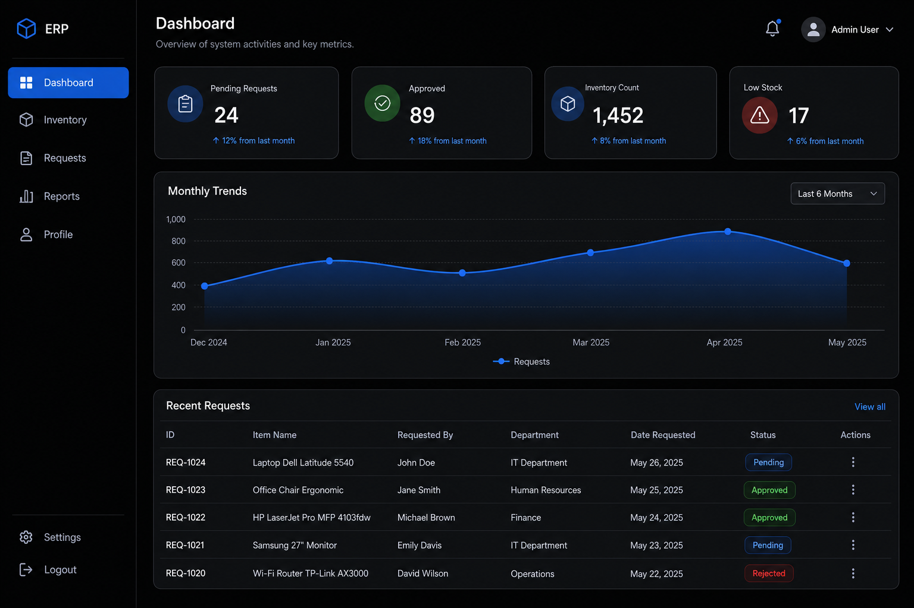

<p align="center">
  
  <br />
  <strong>ResourceHub</strong>
</p>

<p align="center">
  A simple app to manage office inventory and employee resource requests.
  <br />
  Built with Next.js and Supabase — real data, no mock dashboards.
</p>

<p align="center">
  
</p>

**Live:** https://infipark.vercel.app

---

## What it does

- Employees request laptops, monitors, licenses, and other items
- Managers approve or reject requests
- Admins manage inventory and user roles
- Stock updates automatically when a request is approved

---

## Roles (who can do what)

| Role | How they sign in | What they can do |
|------|------------------|------------------|
| **Employee** | [Login](https://infipark.vercel.app/login) — Google or email | View inventory, submit requests, see own profile |
| **Manager** | Same as employee (role set by admin) | Approve/reject requests, view reports |
| **Admin** | [Admin login](https://infipark.vercel.app/admin/login) — email + password only | Add/edit inventory, manage users, full access |

> Admins must use **Admin login**, not the normal employee login.  
> Only emails listed in `ADMIN_EMAILS` can be admins.

---

## Quick start (local)

### 1. Clone and install

```bash
git clone https://github.com/heisnabil/infipark.git
cd infipark
npm install
```

### 2. Environment file

Copy `.env.example` to `.env.local` and fill in your Supabase keys:

```env
NEXT_PUBLIC_SUPABASE_URL=https://your-project.supabase.co
NEXT_PUBLIC_SUPABASE_ANON_KEY=your-anon-key
SUPABASE_SERVICE_ROLE_KEY=your-service-role-key
NEXT_PUBLIC_SITE_URL=http://localhost:3000
ADMIN_EMAILS=you@yourcompany.com
```

### 3. Database (Supabase SQL Editor)

Run these files **in order** (skip `001` if tables already exist):

1. `supabase/migrations/001_production_schema.sql`
2. `supabase/migrations/002_profiles_insert_policy.sql`
3. `supabase/migrations/003_security_hardening.sql`
4. `supabase/migrations/004_activity_rls.sql`

If you see `relation "inventory" already exists`, **001 is done** — run only 002, 003, and 004.

### 4. Create admin account (once)

```bash
# In .env.local also set:
# ADMIN_EMAIL=you@yourcompany.com
# ADMIN_PASSWORD=your-strong-password

npm run admin:create
```

### 5. Run the app

```bash
npm run dev
```

- App: http://localhost:3000  
- Admin: http://localhost:3000/admin/login  
- Employee login: http://localhost:3000/login  

### 6. Google sign-in (optional, for employees)

In Supabase → **Authentication → Google** — enable provider.  
Add redirect URLs:

- `http://localhost:3000/auth/callback`
- `https://infipark.vercel.app/auth/callback` (production)

Set **Site URL** to your production domain in Supabase.

---

## Give someone the Manager role

1. Sign in as **admin** → go to **User Management** (`/admin`)
2. Find the user → change role to **Manager**

Or in Supabase SQL:

```sql
UPDATE public.profiles SET role = 'manager' WHERE email = 'manager@company.com';
```

---

## Deploy on Vercel

1. Import repo on [vercel.com](https://vercel.com) (root folder: `infipark`)
2. Add the same env vars as `.env.local` (`NEXT_PUBLIC_SITE_URL=https://infipark.vercel.app`)
3. Deploy → run `npm run admin:create` locally against production Supabase
4. Supabase **Site URL** + redirect: `https://infipark.vercel.app/auth/callback`
5. Google OAuth redirect: `https://YOUR-PROJECT.supabase.co/auth/v1/callback`

---

## Tech stack

- **Frontend:** Next.js, TypeScript, Tailwind
- **Backend:** Supabase (Postgres, Auth, Storage, RLS)

---

## Repo structure

```
app/              Pages and server actions
lib/services/     Database logic
supabase/         SQL migrations
docs/assets/      Logo and screenshots for README
```

---

## License

Private project — adjust as needed for your team.
